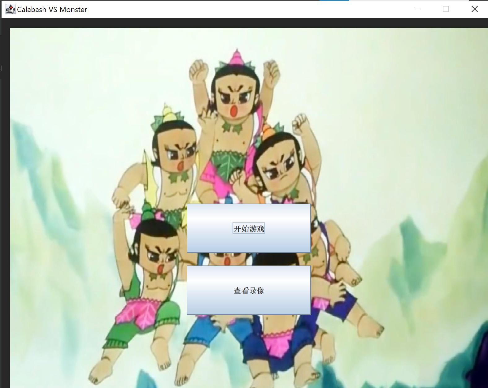
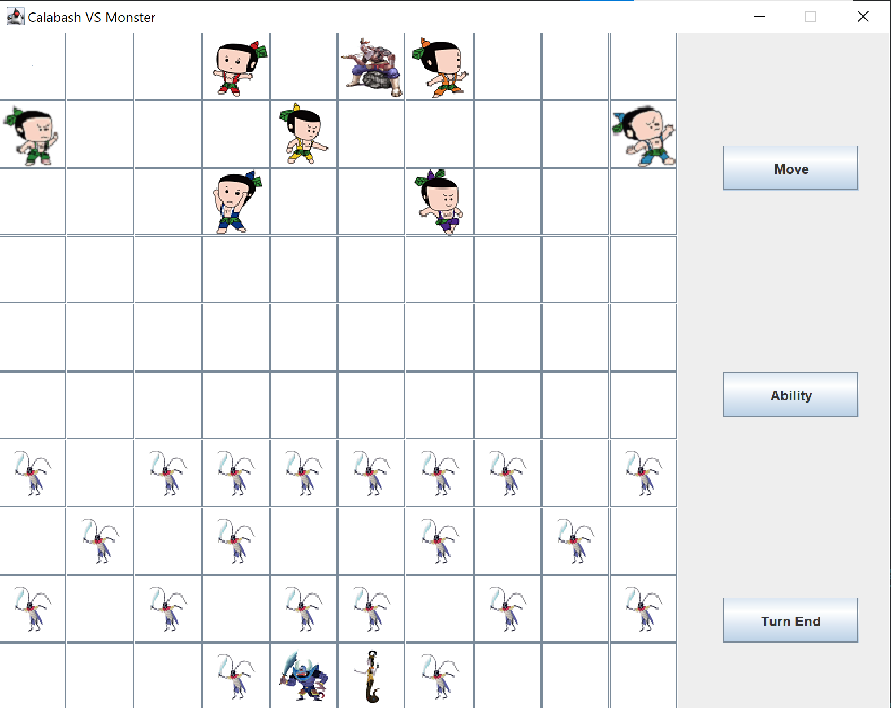

# 葫芦娃大战妖精

回合制下棋游戏，移动方式参考日本将棋、国际象棋以及中国象棋，根据背景添加特色技能机制。

葫芦娃方兵力较少，单兵能力强劲；

妖精方兵力雄厚，单兵能力低下，`king`单位即蝎子精和蛇威胁较大。

## begin



玩家可以选择`开始游戏`或者`查看录像`。录像会寻找`java20`同级的文件夹中的`saved.txt`文件。录像最多保存一个。

## 游戏配置

需要先配置server，方式为运行位于`server`包下的`Server`类中的`main`方法。

IP地址设置位于`client`包下`Client`类中`setUpNetworking`方法中。默认是`127.0.0.1`。

## 游戏流程

玩家进入客户端后选择匹配玩家，系统会自动匹配其它玩家。

匹配结束后，由系统随机指定双方阵营并初始化角色配置。

各个阵营在棋盘上位置固定，葫芦娃在上，妖精在下，葫芦娃先手。

双方在自己的回合可以施放不限制次数的技能和进行一次移动，本回合结束的标志为玩家手动点击`TurnEnd`。

若单位选择移动至和敌方单位重合的格子，视为一次攻击；若没有击杀不会移动，击杀则移动至敌方单位阵亡处。

以双方的`king`单位全部阵亡为游戏结束标志，葫芦娃方是爷爷，妖精方是蝎子精和蛇精。

## 阵营、角色简介

本部分主要介绍各阵营兵力配置和单兵能力。



### 葫芦娃方

兵力配置：7个葫芦娃，1个爷爷。

|角色|移动方式|能力|CD/(回合/次数)|
|---|---|---|---|
|大娃|直线|冲击波，击杀自身半径1格之外的前后左右4格内的所有敌方单位|5|
|二娃|直线|洞察，使敌不敢轻举妄动，封印敌方全体技能1回合|1次|
|三娃|前后左右各1格，左前1格右前1格|金刚不坏，本回合免疫死亡|6|
|四娃|前后左右各2格|喷火，击杀自己所在直线上的第1个敌方单位，己方免疫|5|
|五娃|前后左右各2格|喷水，使自身所在直线上的第1个敌方单位封印1回合|5|
|六娃|日字|隐身，使自身所在位置在下1回合无法被敌方选中|5|
|七娃|左前左后右前右后各1格，正前方1格|紫金葫芦封印，选择1个敌方`king`单位使之下1回合不能使用技能|5|
|爷爷|周围8格|召唤，在自身周围随机8格内召唤1个自定义葫芦娃，死去的葫芦娃会复活，活着的葫芦娃会传送|1次|

### 妖精方

兵力配置：1个蝎子精，1个蛇精，初始20个普通妖精。

|角色|移动方式|能力|CD/(回合/次数)|
|---|---|---|---|
|蛇精|直线、斜线|蛊惑，控制1个葫芦娃的移动控制权，只能进行移动；夺取其技能并且必须立即使用，使用后葫芦娃技能进入冷却；不可以夺取只能使用一次的技能。|10|
|蝎子精|周围8格|弱者退散，使1个葫芦娃后退1格并封印1回合|4|
|普通妖精|前1格，左右各1格|进入敌阵时可选择升级为高级妖精，升级后回到正常状态|无|
|高级妖精|左前右前左后右后各2格|无|无|

注意：

- 封印是指技能和行动均无法操作，封印技能仅仅是技能无法使用；
- 对于隐身单位，无法选中意味着敌方无法攻击此单位，也无法移动到该单位所在位置；
- 蝎子精让葫芦娃后退一格的过程中，后方如果是边界或者葫芦娃方单位则后退失败，如果是妖怪一方则会击杀妖怪，也算还原反派坑队友的情节了。

## 项目架构

本项目采用MVC设计模式。

项目总体分布如下。

```tree
├── Main.java
├── client
│   └── Client.java
├── core
│   ├── Controller.java
│   ├── model
│   │   ├── battlefield
│   │   │   ├── Board.java
│   │   │   └── Position.java
│   │   └── figure
│   │       ├── Calabash.java
│   │       ├── Creature.java
│   │       ├── Goblin.java
│   │       ├── King.java
│   │       ├── movestrategy
│   │       │   ├── LineA.java
│   │       │   ├── LineB.java
│   │       │   ├── LineC.java
│   │       │   ├── MoveStrategy.java
│   │       │   ├── Periphery.java
│   │       │   ├── Queen.java
│   │       │   ├── SlashA.java
│   │       │   ├── SlashAndLineA.java
│   │       │   ├── SlashAndLineB.java
│   │       │   └── Sun.java
│   │       └── skill
│   │           ├── Call.java
│   │           ├── Cucurbit.java
│   │           ├── Fading.java
│   │           ├── Flame.java
│   │           ├── Indestructibility.java
│   │           ├── Insight.java
│   │           ├── Invisibility.java
│   │           ├── Seduction.java
│   │           ├── ShockWave.java
│   │           ├── Skill.java
│   │           ├── Upgrade.java
│   │           └── Water.java
│   └── view
│       ├── GameEndDialog.java
│       ├── LookingGUI.java
│       ├── MainGUI.java
│       ├── MainMenu.java
│       ├── MatchingGUI.java
│       ├── PickDialog.java
│       ├── ReplayDialog.java
│       ├── SaveDialog.java
│       └── TurnPanel.java
├── server
│   └── Server.java
└── util
    ├── GameType.java
    ├── Race.java
    ├── Rand.java
    └── Status.java
```

### core

`core`包下有`model`，`controller`，`view`三部分，分别负责数据模型的搭建，游戏的控制和游戏的显示。

`model`中存有`battlefield`和`figure`，分别存储战场对应的棋盘模型和位置模型。`figure`其中保有`movestrategy`和`skill`，存储行动和技能模型。

`Controller`包含游戏主循环以及所有的事件函数。

## 分工

潘昱光主要负责总体的框架搭建，具体为前端的图形界面、网络接口，到后端的数据模型、持久层的构建。

侯为栋主要负责角色能力和移动策略的编写，资源文件的收集。

游戏设计与代码优化、单元测试、文档编写二者均有。

##  心得体会

- 最大的心得体会是，无论怎么解耦都无法做到职责的完全分离，很是让人头疼；如果没有有依赖注入功能的框架支持，MVC只能是一个总体上的想法，但是实践过程中总会遇到需要需要保有引用的情况，这也必须说和语言的局限性相关。Java的图形页面是事件驱动机制，那么核心的控制模块，如果没有刻意调整的话，应该是view包下一众图形页面的子类子函数，这本身就不是一种适合工程化编程的架构。
- 单例模式要慎用，静态变量是魔鬼。在实际的工程项目中，单例模式虽然有不用保有引用的优点，但也引发了其来源难以追溯的问题；并且从单例的思想出发，本工程中除了board之外很难说有什么是只需要有一个的模型，所以这是一种较为严重的设计失误。
- 扯远一点，一个很有意思的问题。如果这是一个前后端分离的web项目，那么前端和后端的职责分别是什么？思考了一下发现除了接受用户请求并维护线程池之外，并没有什么后端可以做的事情，本项目中用户的请求是没有持久化的必要的，所有的请求，包括资源文件都是可以唯一确定的。但是如果本项目不是7个葫芦娃，而是700个葫芦娃呢？所有的葫芦娃数据，虽然是可以唯一确定的，难道都要存在前端吗？所以正确的逻辑应该是葫芦娃的数据存储在后端数据库，每次游戏从数据库中读取特定的角色数据生成实例缓存在前端。但是这样又如何去实现呢？目前还不知道，期待以后的尝试。
